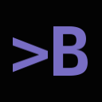

 # BassLive 3.0

## Documentation & API

Checkout the **BassLive Wiki** at: https://www.bassjansson.com/basslive/wiki
Checkout the **BassLive API** at: https://www.bassjansson.com/basslive/api

## Live Coding

Checkout what **Live Coding** is at: https://toplap.org/

## JUCE

Using the amazing **JUCE** framework to build my own live coding environment.
Check it out here: https://www.juce.com/

## Bass Jansson

Studying **Music & Technology** at the HKU in Utrecht, The Netherlands.
See my website for contact details: https://www.bassjansson.com/